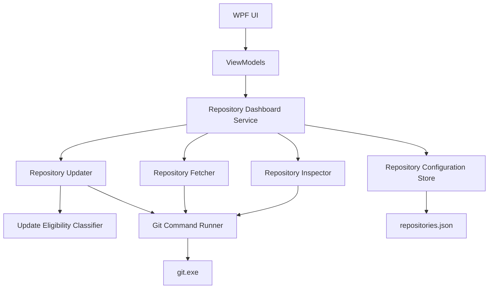

# 04 — High-Level Architecture



## Critical rule

> ViewModels never execute Git commands.

Bad:

```csharp
await Process.Start("git", "pull");
```

inside:

```csharp
RepositoryRowViewModel
```

Good:

```csharp
await _repositoryDashboard.UpdateAsync(repositoryId);
```

The ViewModel knows what the user wants. The application/core services decide how to perform it.
